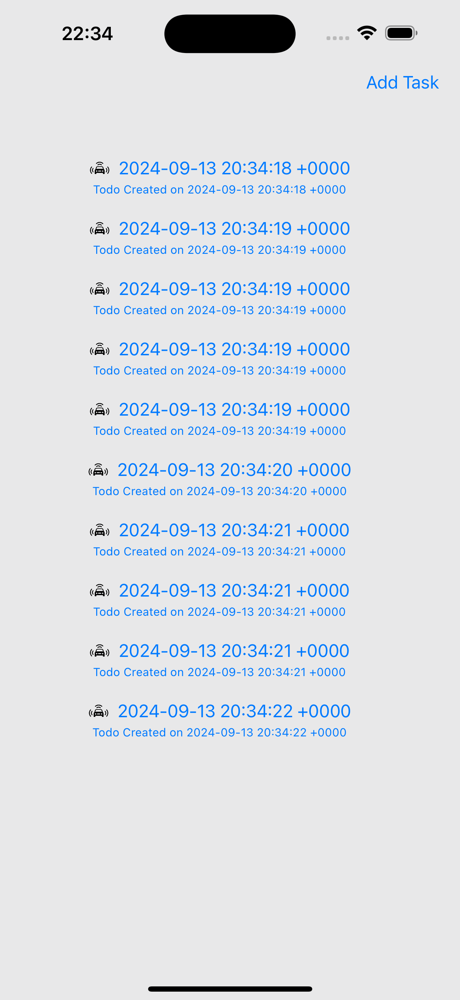
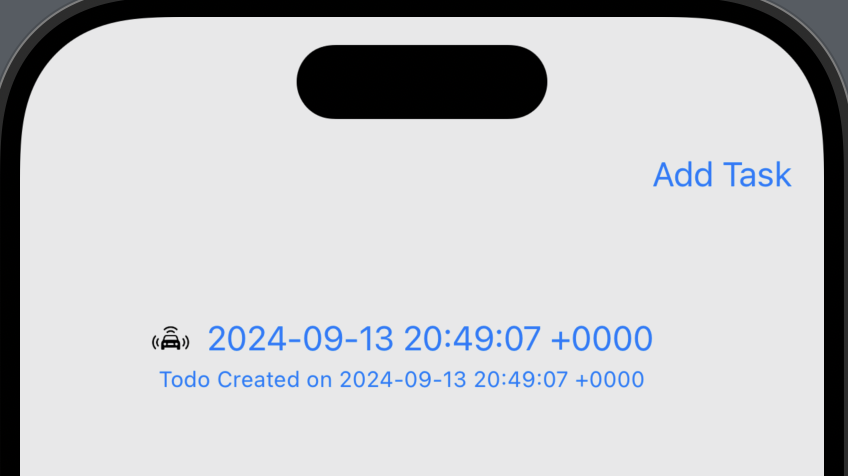
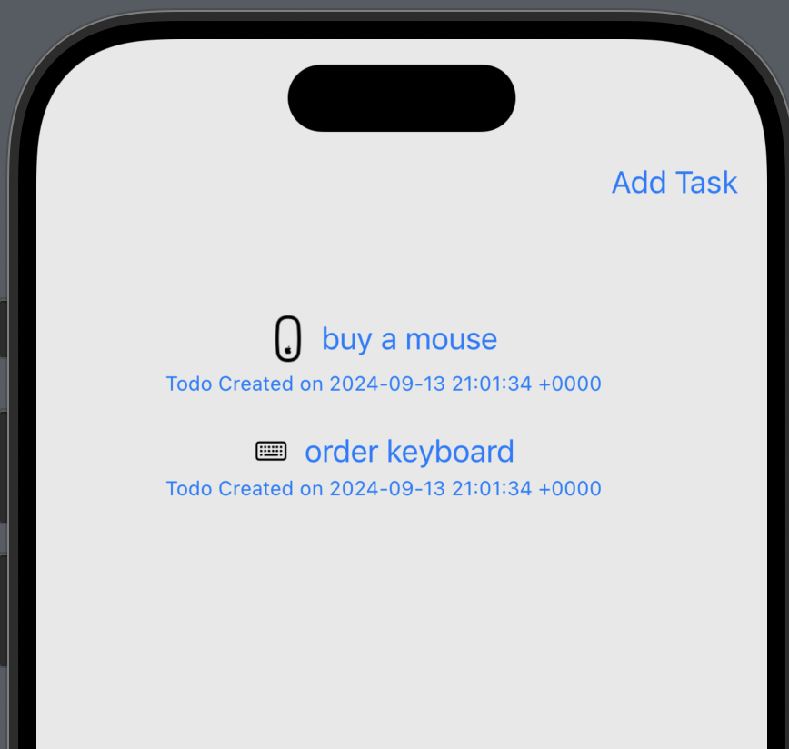
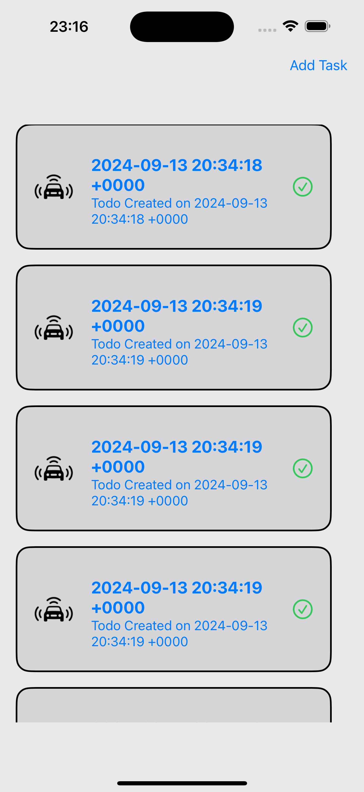

# SwiftUI + SwiftData:


##  Szczegółowe wyjaśnienie z przykładową aplikacją Todo!


*******

### Zanim zaczniemy, mam coś do powiedzenia!

SwiftData jest świetne! Znacznie łatwiejsze w użyciu w porównaniu do CoreData!  
Zdecydowanie warto spróbować, zanim rozważysz inne opcje baz danych!  
*******

### Oto, czym się podzielę w tym artykule:

- Wszystkie podstawy używania **SwiftData** w aplikacji SwiftUI w obrębie widoku, czyli:
  - Tworzenie modelu za pomocą makra `@Model`
  - Manipulacja danymi (zapytania, dodawanie, aktualizowanie i usuwanie)
- Zobaczymy także, jak stworzyć prostą relację wiele-do-wielu oraz inne opcje dostępne przez makro zapytania, takie jak ustawianie kolejności sortowania, konfiguracja limitu pobierania i przesunięcia itp.

Jeśli jesteś zainteresowany używaniem **SwiftData** poza widokiem SwiftUI, czyli w klasie menedżera lub modelu widoku, koniecznie sprawdź mój następny artykuł: **SwiftUI: Użycie SwiftData poza widokiem (w klasie menedżera/modelu widoku).**

Wykorzystamy prostą aplikację Todo jako nasz przykład.

**Aplikacja demonstracyjna została również opublikowana na GitHubie!** Śmiało pobierz ją i eksperymentuj!

### Tworzenie nowego projektu

(Uwaga: nie będziesz musiał włączać **SwiftData** podczas tworzenia projektu!)

#### Tworzenie modelu

Na początku musimy utworzyć nasz model, obiekt SwiftData, który jest zapisywany w bazie danych i synchronizowany z iCloud. Możemy na nim wykonywać zapytania, wyszukiwania, sortowania i wiele innych operacji, jak zobaczymy za chwilę.

Aby przekonwertować istniejącą klasę na model **SwiftData**, wystarczy zaimportować **SwiftData** i oznaczyć naszą klasę makrem `@Model`. To makro opiera się na tym samym systemie obserwacji co `@Observable`, co oznacza, że mamy śledzenie zmian dla klasy domyślnie, co pozwala SwiftUI na odświeżenie widoku, gdy wystąpią zmiany w jakimkolwiek z pobranych instancji.

```swift
import SwiftUI
import SwiftData

@Model
class TodoModel {
    
    @Attribute(.unique) var id: UUID = UUID()
    var title: String
    var content: String
    var iconData: Data
    
    var icon: Image {
        if let uiImage = UIImage(data: iconData) {
            return Image(uiImage: uiImage)
        } else {
            return Image(systemName: "questionmark.diamond.fill")
        }
    }

    var createDate: Date
    var isDone: Bool
    
    var tags: [Tag]
    
    init(title: String, content: String, icon: UIImage, createDate: Date, isDone: Bool, tags: [Tag]) {
        self.title = title
        self.content = content
        self.iconData = icon.pngData() ?? Data()
        self.createDate = createDate
        self.isDone = isDone
        self.tags = tags
    }
}
```

#### Tworzenie relacji i dodatkowych modeli

```swift
@Model
class Tag {
    var name: String
    var color: TagColor
    @Relationship(inverse: \TodoModel.tags) var todos: [TodoModel]

    init(name: String, color: TagColor, todos: [TodoModel]) {
        self.name = name
        self.color = color
        self.todos = todos
    }
}

enum TagColor: Codable, CaseIterable {
    case red
    case blue
    case mint
    case orange
    
    var color: Color {
        switch self {
        case .red:
            return .red
        case .blue:
            return .blue
        case .mint:
            return .mint
        case .orange:
            return .orange
        }
    }
}
```

Dodałem tutaj trochę więcej, aby pokazać, jak obsługiwać różne typy danych, takie jak proste typy (`Bool`, `Date`, `String`), bardziej złożone typy wartości, takie jak `struct` i `enum`, a także `UIImage` i `Color`. Jak widać, aby używać złożonych typów z modelem **SwiftData**, wystarczy, aby te typy spełniały protokół `Codable`.

#### Ważne uwagi

- **SwiftData** uwzględnia tylko wszystkie **nieobliczane** właściwości klasy, o ile używają one zgodnych typów.  
- Oznacza to, że właściwość `color` w `TagColor` nie będzie uwzględniona. To jest jeden ze sposobów przechowywania obiektu `Color`. Można go również przechowywać jako wartość w formacie hex lub rgb, ale niestety przechowywanie jako `Color` samo w sobie nie zadziała.
- Podobnie jest z obrazkami. Aby przechowywać obraz w **SwiftData**, musimy użyć jego reprezentacji danych. Ponownie, ponieważ zmienna `icon` jest właściwością obliczaną, nie będzie ona przechowywana.


### Dostosowywanie zachowań utrwalania

Aby dostosować zachowanie atrybutu, możemy oznaczyć właściwość makrem `@Attribute(_:originalName:hashModifier:)` i określić wartości dla opcji, które sterują pożądanym zachowaniem. Oto kilka przykładów, które mogą Cię zainteresować!

1. **Ustawienie unikalności pola**: Aby upewnić się, że ten sam obiekt `TodoModel` nie zostanie zapisany dwa razy, możemy oznaczyć pole `id` jako unikalne:
   ```swift
   @Attribute(.unique) var id: UUID = UUID()
   ```

2. **Zmiana relacji między modelami**: Na przykładzie relacji między `TodoModel` a `Tag`, możemy oznaczyć właściwość `tags` makrem `@Relationship(_:deleteRule: minimumModelCount: maximumModelCount: originalName: inverse:hashModifier:)`, aby określić relację wiele-do-wielu. Dodatkowo możemy określić regułę usuwania (`deleteRule`) między relacjami.

   - Domyślnie reguła usuwania jest ustawiona na **nullify**, co oznacza, że framework ustawi atrybuty relacji na `nil` po usunięciu powiązanej instancji modelu (np. usunięcie `TodoModel` nie usunie powiązanych tagów `Tags`).
   - Możemy również ustawić regułę usuwania na **cascade**, co oznacza, że wszystkie powiązane obiekty zostaną usunięte, gdy obiekt nadrzędny zostanie usunięty. Na przykład, jeśli chcemy usunąć wszystkie powiązane tagi, gdy `TodoModel` zostanie usunięty, możemy zmienić regułę na **cascade** w następujący sposób:
   ```swift
   @Relationship(deleteRule: .cascade) var tags: [Tag]
   ```

3. **Wykluczanie właściwości z zapisu**: Wszystkie nieobliczane właściwości są domyślnie zapisywane. Jeśli nie chcemy, aby jakaś wartość była zapisana, możemy oznaczyć ją makrem `@Transient()`:
   ```swift
   @Transient var createDate: Date
   ```

### Manipulacja danymi

#### Kontener modelu

Aby zarządzać danymi, najpierw musimy skonfigurować domyślne miejsce przechowywania danych. W tym celu użyjemy modyfikatora `modelContainer(for: inMemory: isAutosaveEnabled: isUndoEnabled: onSetup:)`. Ten modyfikator jest dostępny zarówno dla widoku, jak i sceny, co oznacza, że możemy go dołączyć do `WindowGroup` lub bezpośrednio do naszego widoku. Jeśli zdecydujesz się użyć modyfikatora widoku, dodaj go na samym początku hierarchii widoków, aby wszystkie zagnieżdżone widoki dziedziczyły prawidłowo skonfigurowane środowisko.

```swift
import SwiftUI

@main
struct SwiftDataDemoApp: App {
    var body: some Scene {
        WindowGroup {
            ContentView()
        }
        .modelContainer(for: [TodoModel.self, Tag.self])
    }
}
```

Zauważ, że dodaliśmy tutaj zarówno `TodoModel`, jak i `Tag`. Jednak nie jest to konieczne, jeśli istnieje relacja między modelami. Możemy pominąć typ modelu docelowego z tablicy, a **SwiftData** automatycznie przeszuka relacje modelu i dołączy wszystkie typy modeli docelowych za nas! Możemy więc zrobić to w ten sposób:

```swift
.modelContainer(for: [TodoModel.self])
```

Jak widać z definicji modyfikatora, możemy dokonać kilku innych konfiguracji. Jedną z ważniejszych opcji, na którą warto zwrócić uwagę, jest opcja `inMemory`. Określa ona, czy kontener powinien przechowywać dane tylko w pamięci. Upewnij się, że ustawisz ją na `true` podczas testowania w **Preview** (chyba że chcesz zapełnić swój dysk!).

```swift
#Preview {
    return ContentView()
        .modelContainer(for: TodoModel.self, inMemory: true)
}
```

#### Kontekst modelu

**Model Context** to klucz do zarządzania danymi. Ten obiekt odpowiada za dane modelu w pamięci oraz koordynację z kontenerem modelu w celu skutecznego ich utrwalania. Użyjemy go do pobierania, wstawiania, usuwania i aktualizowania modeli!

Aby uzyskać kontekst dla kontenera modelu powiązanego z głównym aktorem, możemy użyć zmiennej środowiskowej `modelContext`.

```swift
import SwiftUI
import SwiftData

struct ContentView: View {
    @Environment(\.modelContext) private var modelContext

    // dalsza implementacja
}
```

#### Pobieranie danych

Aby pobrać zapisane dane, możemy użyć opakowania właściwości `Query`.

Oto szybki przykład:

```swift
import SwiftUI
import SwiftData

struct ContentView: View {
    @Environment(\.modelContext) private var modelContext
    @Query(sort: \TodoModel.createDate, order: .forward, animation: .smooth) var todoList: [TodoModel]
    @Query var tags: [Tag]

    var body: some View {
        ScrollView {
            VStack(spacing: 20) {
                ForEach(todoList) { todo in
                    Text(todo.title)
                }
            }
            .scrollTargetLayout()
        }
        .scrollIndicators(.hidden)
        .padding(.vertical, 50)
        .padding(.trailing, 20)
        .frame(maxWidth: .infinity, maxHeight: .infinity)
        .background(.gray.opacity(0.2))
        .onChange(of: todoList) {
            print("todo list changed")
        }
    }
}
```


#### Dane testowe 

Niestety nie mamy żadnych danych, więc na szybko dodajmy przycisk, który na żądanie doda nam kolejny rekord. Opakujmy `ScrollView` w `NavigationStack`i pod ScrollView podczepmy toolbar

```swift
NavigationStack{
  ScrollView {...}
  ....
  .toolbar {
    Button("Add Task") {
      addTodo()
    }
  }
}
```

Zdefiniujmy funkcę dodającą rekord:

```swift
    private func addTodo() {
        let date = Date()
        let newTodo = TodoModel(title: "\(date)", content: "Todo Created on \(Date())", iconData: UIImage(systemName: "car.front.waves.left.and.right.and.up.fill")!,  tags: tags)
        modelContext.insert(newTodo)
    }
```




To nie jest docelowa metoda dostarczania testowych danych.

Kontener, który ustawisz, będzie odnosił się do kontenera aplikacji, a podgląd nie może korzystać z tego samego kontenera. Dlatego podgląd potrzebuje własnego kontenera, aby działał poprawnie. Rozwiązaniem, którego obecnie używamy, jest ustawienie kontenera dla podglądu:

```swift
#Preview {
    CountryScreen()
    .modelContainer(for: TodoModel.self)
}
```

Teraz kontener jest ustawiony dla podglądu; to naprawia problem: TAK i NIE.

**Dlaczego TAK?**  
Tak, podgląd działa.  
Możesz dodać go i zobaczyć dane w podglądzie.

**Dlaczego NIE?**  
Teraz Twoja aplikacja i podgląd dzielą ten sam kontener.  
Dane używane do podglądu nie muszą być trwałe, a dane trwałe mogą zostać naruszone.

**Kolejny problem**  
Nie będzie początkowych danych.  
Różne warianty danych (ponieważ dane napędzają UI) mogą nie być dostępne.

Aby rozwiązać wszystkie te problemy, pojawia się Mocking (imitowanie danych).

Przed imitowaniem danych nadal potrzebujemy kontenera do dodania danych do podglądu, więc aby uniknąć konfliktu, wykonujemy następujące kroki:  
- Tworzymy niestandardowy kontener.  
- Upewniamy się, że kontener z danymi jest używany tylko do podglądu (bez zapisywania).  
- Dodajemy fałszywe dane do kontenera, oto jak to zrobić:

```swift
#Preview {

    let container = try! ModelContainer(for: TodoModel.self,
                                        configurations: ModelConfiguration(isStoredInMemoryOnly: true))
    let date = Date()
    let newTodo = TodoModel(title: "\(date)", content: "Todo Created on \(Date())", iconData: UIImage(systemName: "car.front.waves.left.and.right.and.up.fill")!,  tags: [])
    container.mainContext.insert(newTodo)
    return ContentView()
        .modelContainer(container)
}
```

Z powyższego kodu wynika, że stworzyliśmy kontener i dodaliśmy dane do podglądu w celu imitowania. Powinno to wyglądać mniej więcej tak:



Teraz masz dane, aby zobaczyć podgląd bez dodawania ani manipulowania rzeczywistym kodem. Możesz więc zweryfikować renderowanie interfejsu użytkownika bez żadnych problemów.

### Ulepszenie podejścia

W powyższym kodzie podglądu, jeśli spróbujesz dodać więcej danych, kod staje się bardziej skomplikowany (wiele schematów itp.).  
Kod znajduje się w głównym widoku, co sprawia, że wygląda na dłuższy.  
Ponadto może istnieć wiele podglądów, a wszystkie umieszczone w każdym widoku są trudne do śledzenia.  

Dlatego lepiej jest oddzielić mocki (imitacje) od rzeczywistego kodu produkcyjnego, upewniając się, że cały kod jest dostępny w jednym miejscu, co ułatwia dostęp i utrzymanie. Z pomocą przychodzą nam **rozszerzenia**.

#### Przykład użycia rozszerzeń

```swift
import Foundation
import SwiftData
import SwiftUI

extension TodoModel {
    @MainActor
    static var preview: ModelContainer {
        let container = try! ModelContainer(for: TodoModel.self, configurations: ModelConfiguration(isStoredInMemoryOnly: true))
        let date = Date()

        container.mainContext.insert(TodoModel(title: "buy a mouse", content: "Todo Created on \(Date())",
                                               iconData: UIImage(systemName: "magicmouse")!,  tags: []))
        container.mainContext.insert(TodoModel(title: "order keyboard", content: "Todo Created on \(Date())",
                                               iconData: UIImage(systemName: "keyboard")!,  tags: []))
        return container
    }
}
```

Utwórz nowy plik Swift w swoim projekcie i wprowadź powyższy kod lub użyj istniejącego pliku modelu.

Dzięki rozszerzeniu i zmiennym statycznym możemy uprościć nasz kod podglądu do postaci:

```swift
#Preview {
    ContentView()
    .modelContainer(Country.preview)
}
```

To zapewnia przejrzysty wygląd podglądu i pozwala dodać dowolną logikę widoku wymaganą dla podglądu, a także izolować dane testowe w zupełnie innych plikach.



### Dodatkowe korzyści

- Możesz przenieść pliki rozszerzeń i zasoby (jeśli istnieją) związane z podglądem do folderu „preview content”. Niebęda one dołaczane do wersji wgrywanej na urządzenie, co uchroni nas przed ładowaniem danych testowych do docelowej apliakcji.
- Więcej informacji o „preview content” znajdziesz w wideo z WWDC.

https://developer.apple.com/videos/play/wwdc2020/10149


### Odpytywanie danych

Jak widać, istnieje wiele parametrów, które można określić za pomocą zapytania (`query`). Oprócz tych wymienionych powyżej, można również określić `FetchDescriptor` dla deskryptora, `Predicate` do filtrowania itp. 

Na przykład, jeśli chcesz ograniczyć liczbę pobieranych wyników do 1 (czyli zwrócić tylko 1 obiekt `TodoModel`), możesz to zrobić, inicjując zapytanie z deskryptorem w następujący sposób:

```swift
static var descriptor: FetchDescriptor<TodoModel> {
    var descriptor = FetchDescriptor<TodoModel>(
        predicate: nil,
        sortBy: [
            .init(\.createDate)
        ]
    )
    descriptor.fetchLimit = 1
    return descriptor
}

@Query(Self.descriptor) var todoList: [TodoModel]
```

Możesz również określić warunki, takie jak `predicate: #Predicate { $0.isDone == false }`, aby pobrać tylko te zadania, które nie zostały zakończone.

#### Wstawianie, aktualizowanie, usuwanie

Manipulacje danymi są proste i intuicyjne.

- **Wstawianie danych:** `modelContext.insert(_:)` rejestruje określony model w kontekście, aby mógł być uwzględniony w następnej operacji zapisu.
- **Usuwanie danych:** `modelContext.delete(_:)` usuwa określony model z trwałego magazynu podczas następnej operacji zapisu.
- **Usuwanie z predykatem:** `modelContext.delete(model:where:includeSubclasses:)` usuwa każdy model spełniający dany predykat z trwałego magazynu podczas następnej operacji zapisu — jest to bardzo przydatne, jeśli chcesz usunąć wszystkie dane testowe określonego modelu za jednym razem.

A co z aktualizacją?

Nie musisz nawet używać `modelContext` do wykonania aktualizacji. Na przykład, jeśli chcesz ustawić `TodoModel` na zakończone, wystarczy:

```swift
todo.isDone = true
```

Przyjrzyjmy się temu na przykładzie naszej aplikacji Todo

```swift
import SwiftUI
import SwiftData

struct ContentView: View {
    static var descriptor: FetchDescriptor<TodoModel> {
        var descriptor = FetchDescriptor<TodoModel>(
//            predicate: #Predicate {$0.isDone == false}, // example for retrieve un-done only
            predicate: nil,
            sortBy: [
                .init(\.createDate)
            ]
        )
        descriptor.fetchLimit = 10
        return descriptor
    }
    
    @Environment(\.modelContext) private var modelContext
    @Query(Self.descriptor) var todoList: [TodoModel]
//    @Query(sort: \TodoModel.createDate, order: .forward, animation: .smooth) var todoList: [TodoModel]
    
    @Query var tags: [Tag]

    
    var body: some View {
        ScrollView {
            VStack(spacing: 20) {
                HStack(spacing: 10) {
                    Button(action: {
                        addTodo()
                    }, label: {
                        Text("Add Todo")
                    })
                    .foregroundStyle(.white)
                    .padding()
                    .background(RoundedRectangle(cornerRadius: 16).fill(.black))

                    Button(action: {
                        addTag()
                    }, label: {
                        Text("Add Tag")
                    })
                    .foregroundStyle(.white)
                    .padding()
                    .background(RoundedRectangle(cornerRadius: 16).fill(.black))
                    
                    Button(action: {
                        guard let lastTag = tags.last else {return}
                        deleteTag(lastTag)
                    }, label: {
                        Text("Delete Tag")
                    })
                    .foregroundStyle(.white)
                    .padding()
                    .background(RoundedRectangle(cornerRadius: 16).fill(.black))

                }
                Spacer()
                    .frame(height: 10)
                
                
                ForEach(todoList) { todo in
                    HStack {
                        TodoCard(todo: todo)
                        
                        VStack(spacing: 20) {
                            if !todo.isDone {
                                Button(action: {
                                    updateTodo(todo)
                                }, label: {
                                    Image(systemName: "checkmark.circle")
                                        .font(.system(size: 24))
                                        .foregroundStyle(Color.green)

                                })
                            }
                            Button(action: {
                                deleteTodo(todo)
                            }, label: {
                                Image(systemName: "trash")
                                    .font(.system(size: 24))
                                    .foregroundStyle(Color.red)
                            })


                        }
                    }
                }
            }
            .scrollTargetLayout()
        }
        .scrollIndicators(.hidden)
        .padding(.vertical, 50)
        .padding(.trailing, 20)
        .frame(maxWidth: .infinity, maxHeight: .infinity)
        .background(.gray.opacity(0.2))

    }
    
    private func addTodo() {
        let date = Date()
        let newTodo = TodoModel(title: "\(date)", content: "Todo Created on \(Date())", icon: UIImage(systemName: "hare.fill")!, createDate: date, isDone: false, tags: tags)
        modelContext.insert(newTodo)
    }
    
    private func addTag() {
        let color = TagColor.allCases.randomElement() ?? .blue
        let newTag = Tag(name: "Tag \(tags.count + 1)", color: color, todos: [])
        modelContext.insert(newTag)
    }
    
    private func deleteTag(_ tag: Tag) {
        modelContext.delete(tag)
    }
    
    private func updateTodo(_ todo: TodoModel) {
        todo.isDone = true
    }
    
    private func deleteTodo(_ todo: TodoModel) {
        modelContext.delete(todo)
    }
    

}

@propertyWrapper @Observable class ObservableModel<T> {
    var wrappedValue: T
    
    init(wrappedValue: T) {
        self.wrappedValue = wrappedValue
    }
}


```

Ups, dużo kodu naraz!  
Głównie rozkład widoku!  

```swift
struct TodoCard: View {
    @ObservableModel var todo: TodoModel
    
    var body: some View {
        HStack(spacing: 20) {

            todo.icon
                .resizable()
                .scaledToFit()
                .frame(width: 50)
            
            VStack(spacing: 10) {
                HStack {
                    ForEach(todo.tags) { tag in
                        Text(tag.name)
                            .font(.system(size: 12))
                            .foregroundStyle(Color.white)
                            .padding(.vertical, 4)
                            .padding(.horizontal, 8)
                            .background(RoundedRectangle(cornerRadius: 4).fill(tag.color.color))

                    }
                }
                .frame(maxWidth: .infinity, alignment: .leading)

                VStack {
                    Text(todo.title)
                        .font(.system(size: 20, weight: .bold))
                        .frame(maxWidth: .infinity, alignment: .leading)
                        .multilineTextAlignment(.leading)


                    Text(todo.content)
                        .font(.system(size: 16))
                        .frame(maxWidth: .infinity, alignment: .leading)
                        .multilineTextAlignment(.leading)
                }


            }
            
            Image(systemName: todo.isDone ? "checkmark.circle" : "questionmark.circle")
                .font(.system(size: 24))
                .foregroundStyle(todo.isDone ? Color.green : Color.red)


        }
        .padding(.all, 20)
        .frame(maxWidth: .infinity)
        .frame(height: 150)
        .background(RoundedRectangle(cornerRadius: 16).fill(.gray.opacity(0.2)).stroke(.black, style: .init(lineWidth: 2.0)))
        .padding(.horizontal, 20)
        .onAppear {
            print(todo.tags)
        }
       
    }
}
```




Najważniejsze części to poniższe funkcje, w których wykonujemy wszystkie operacje na danych.

```swift
private func addTodo() {
    let date = Date()
    let newTodo = TodoModel(title: "\(date)", content: "Todo Created on \(Date())", icon: UIImage(systemName: "hare.fill")!, createDate: date, isDone: false, tags: tags)
    modelContext.insert(newTodo)
}

private func addTag() {
    let color = TagColor.allCases.randomElement() ?? .blue
    let newTodo = Tag(name: "Tag \(tags.count + 1)", color: color)
    modelContext.insert(newTodo)
}

private func deleteTag(_ tag: Tag) {
    modelContext.delete(tag)
    save()
}


private func updateTodo(_ todo: TodoModel) {
    todo.isDone = true
}

private func deleteTodo(_ todo: TodoModel) {
    modelContext.delete(todo)
}
```

Możesz się zastanawiać, dlaczego nigdy nie wykonujemy żadnych działań związanych z zapisem?  
Gdy tworzymy nasz `modelContainer`, właściwość `isAutosaveEnabled` jest domyślnie ustawiona na `true`, co oznacza, że NIE musimy wywoływać zapisu jawnie. **SwiftData** automatycznie zapisze dla nas `modelContext`!  
Jeśli nie masz do tego zaufania, możesz również wywołać jawnie `try? modelContext.save()`, aby zapisać wszelkie oczekujące wstawienia, zmiany i usunięcia do trwałej pamięci.

Jeszcze jedna bardzo ważna kwestia, na którą chciałbym tutaj zwrócić uwagę, to **ObservableModel**.  
Uważam, że to błąd w **SwiftData**, ale jeśli tego nie użyjemy do opakowania zmiennej `todo` w naszym `TodoCard`, widok karty nie zostanie zaktualizowany, gdy powiązany tag zostanie usunięty. (Zaktualizuje się poprawnie, jeśli dodasz kod w `TodoCard` bezpośrednio do widoku nadrzędnego, w tym przypadku do `ContentView`).